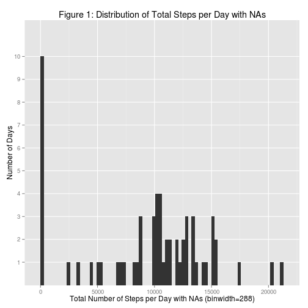
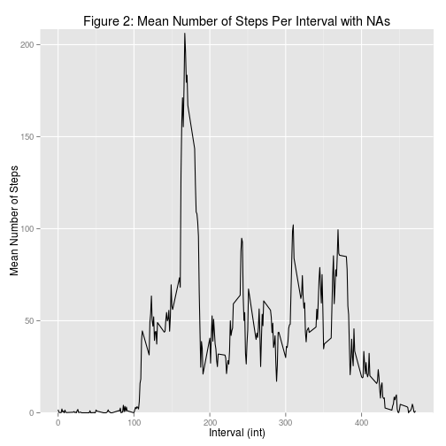
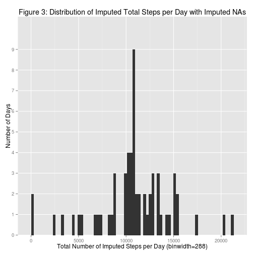
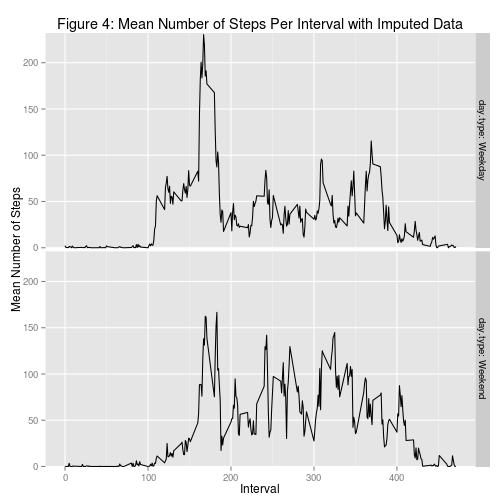

## Introduction

The assignment calls for an R Markdown document to report on the
results of the analysis. In the following sections I explain the
analysis and the R code that implements the analysis. The sections
include the use and othercharacteristics of each of the R objects ---
files, datasets, variables, and plots --- and the code that processes
them.

To prepare for the analysis, I fork
'(http://github.com/rdpeng/RepData_PeerAssessment1)' to
'https://github.com/RonWebber/RepData_PeerAssessment1', and then clone
the repository to the directory '~/DSRR-034/PA1/' on my computer. The
name of the downloaded directory is 'RepData_PeerAssessment1', which I
open. 

## Loading and preprocessing the data

The program sets the working directory to
'~/DSRR-034/PA1/RepData_PeerAssessment1'.  This directory contains two
subdirectories, 'doc' and 'instructions_fig', and four files,
'activity.zip', 'activity.csv', 'README.md', and 'PA1_template.Rmd'.
The two directories contain instructions for analysing the data. More
instructions are in a file named 'README.md'. The file
'PA1_template.Rmd' is an outline template for this file.  The program
then installs, if they are missing, packages 'dplyr', 'ggplot2', and
'readr', and attaches them.


```r
setwd('~/DSRR-034/PA1/RepData_PeerAssessment1')
if(! ('dplyr' %in% rownames(installed.packages()))) {
    install.packages('dplyr')
}
library(dplyr)
if(! ('ggplot2' %in% rownames(installed.packages()))) {
    install.packages('ggplot2')
}
library(ggplot2)
if(! ('readr' %in% rownames(installed.packages()))) {
    install.packages('readr')
}
library(readr)
```

Next the program loads the data.  

'activity' is a dataframe of 17,568 observations and three variables,
'steps', 'date', and 'interval'. It is the record of the number of
steps an anonymous person took during October and November in 2012.

The integer variable 'steps' is the number of steps the person took in
each interval on each day.

The variable 'date' is a character string representing the day the
steps were taken. The format of the date variable is 'yyyy-mm-dd'
where 'y' represents a year digit, 'm' represents a month digit, and
'd' represents a day digit.

The integer variable 'interval' is a representation of the starting
time of an interval. The format of the 'interval' variable is 'm',
'mm', 'hmm', or 'hhmm' where 'm' represents a digit in a minute and
'h' represents a digit in an hour.

Some of the values in 'steps' are missing; they are represented by
'NA's.  The program ignores 'NA' values ('na.rm=TRUE') when it
computes means and medians. The phrase '.with.NAs' is an appendage to
variable names that are computed from data that have missing
values. Later, values are imputed for these missing values to get more
representative results from the analysis. The phrase '.without.NAs' is
an appendage to variable names that have imputed values in place of missing
values.  

The program adds the 'int' variable in 'activity'. It is a convenient identifier for intervals and is used in plots. To convert to 'interval' from 'int', multiply by 5.


```r
activity <- read_csv('activity.zip')
(date.activity.down.loaded <- date())
```

```
## [1] "Thu Nov  5 11:55:05 2015"
```

```r
activity <- mutate(activity, int=interval/5)
```

## What is the mean total number of steps taken per day?

For each of the 61 days the program calculates the total steps taken
in that day by summing the number of steps in all the intervals in
that day. The 61-by-2 dataframe 'total.steps.per.day.with.NAs' has two
variables, 'date', which are the dates of the 61 days in 'activity',
and 'total.per.day.with.NAs', which are the number of steps the person
took each day. Eight days in 'activity' have 'NA's in all 'step'
values, which accounts for the 8*288 = 2304 'NA's.
(The appendage 'with.NAs' in this dataframe means that the variables
were computed from data that have missing values, not that the
dataframe has missing values.)  


```r
total.steps.per.day.with.NAs <- group_by(activity, date) %>% 
    summarise(total.per.day.with.NAs=sum(steps, na.rm=TRUE))
```

Figure 1 is a histogram of 'total.steps.per.day.with.NAs'. The bin
width is 288, so each bin contains all the intervals in one day.


```r
ggplot(total.steps.per.day.with.NAs, aes(x=total.per.day.with.NAs)) +
    geom_histogram(binwidth=288) +
    labs(title='Figure 1: Distribution of Total Steps per Day with NAs') +
    labs(x='Total Number of Steps per Day with NAs (binwidth=288)') +
    labs(y='Number of Days') + 
    scale_y_discrete(breaks=1:12)
```

 

```r
dev.copy(png, file='figure.1.png')
dev.off()
```

Eight of the days with zero steps are days with 'NA's in the entire
step column.  'na.rm' replaces 'NA's with zeros in some cases.

The numeric value 'mean.total.steps.per.day.with.NAs' in the next code
chunk is the average number of steps taken in all the days. The
average is 9354.23.  The numeric value
'median.total.steps.per.day.with.NAs' is the median of steps
taken. The median is 10395.


```r
(mean.total.steps.per.day.with.NAs <- 
    mean(total.steps.per.day.with.NAs$total.per.day.with.NAs))
```

```
## [1] 9354.23
```

```r
(median.total.steps.per.day.with.NAs <- 
    median(total.steps.per.day.with.NAs$total.per.day.with.NAs))
```

```
## [1] 10395
```

## What is the average daily activity pattern?

In the previous section, the focus is on the number of steps in each
of the 61 days. In this section the focus is on the number of steps in
each of the 288 intervals in a day. 'mean.steps.per.interval.with.NAs'
is a dataframe with 288 observations and two variables: 'int.id' and
'mean.per.interval.with.NAs', the number of steps the person took in
each of the intervals averaged over the days.


```r
mean.steps.per.interval.with.NAs <- group_by(activity, int) %>%
    summarise(mean.per.interval.with.NAs=mean(steps, na.rm=TRUE))
```

Figure 2 is a plot of the mean number of steps in each interval.  


```r
ggplot(mean.steps.per.interval.with.NAs, aes(x=int, y=mean.per.interval.with.NAs)) + 
    geom_line() + labs(title='Figure 2: Mean Number of Steps Per Interval with NAs') +
    labs(x='Interval (int)') +
    labs(y='Mean Number of Steps') + 
    scale_y_discrete(breaks=c(0, 50, 100, 150, 200)) 
```

 

```r
dev.copy(png, file='figure.2.png') 
dev.off() 
```

The program next computes the interval which has the most steps on average
across the days.  It is 835 (i.e. 8:35 AM), which has an 'int' value of 167.


```r
(activity$interval[max.mean.steps.per.interval.with.NAs <-
        (which(max(mean.steps.per.interval.with.NAs$mean.per.interval) == 
            mean.steps.per.interval.with.NAs$mean.per.interval.with.NAs))])
```

```
## [1] 835
```

## Imputing missing values

Imputing missing values in a dataset means using existing values to
compute a value to fill in the missing value. The computation
generally uses existing values that are "similar" to the missing
value. All the missing values are in the 'steps' column of
'activity. I choose to replace a missing value with the mean of all
the existing values for the same interval as that of the missing
value.

The program first computes the number of missing values. That number
is 2304. Then it computes the mean number of steps of all the intervals.
'mean.steps.per.interval.with.NAs' is a dataframe with 288
observations and two variables, 'int' and
'mean.per.interval.with.NAs'. The second variable is the mean number
of steps for the interval 'int'.

The program loops though all the observations. When it finds a missing
value, it fills the value with the mean for the interval of the
missing value.
 

```r
(number.of.NAs <- sum(is.na(activity)))
```

```
## [1] 2304
```

```r
mean.steps.per.interval.with.NAs <- group_by(activity, int) %>%
    summarise(mean.per.interval.with.NAs=mean(steps, na.rm=TRUE))

for (i in 1:nrow(activity)) {
    if (is.na(activity$steps[i])) {
        j <- which(mean.steps.per.interval.with.NAs$int == activity$int[i])
        activity$steps[i] <- mean.steps.per.interval.with.NAs$mean.per.interval.with.NAs[j]
    }
}
sum(is.na(activity))
```

```
## [1] 0
```

At this point, there are no missing values in 'activity'. The program
next plots a histogram similar to Figure 1, but using the version of
'activity' with inputed values for missing data. To plot the histogram, the program needs to get the total steps per day with the real data and the
imputed data.  


```r
(total.steps.per.day.without.NAs <- group_by(activity, date) %>%
    summarise(total.per.day.without.NAs=sum(steps)))
```

```r
ggplot(total.steps.per.day.without.NAs, aes(x=total.per.day.without.NAs)) +
    geom_histogram(binwidth=288) +
    labs(title=
	'Figure 3: Distribution of Imputed Total Steps per Day with Imputed NAs') +
    labs(x='Total Number of Imputed Steps per Day (binwidth=288)') +
    labs(y='Number of Days') +
    scale_y_discrete(breaks=0:12)
```

 

```r
dev.copy(png, file='figure.3.png')
dev.off()
```

As before, the program calculates the the mean number of steps per day
and the median number of steps per day. The mean number of steps per
day is 9503.869 and the median number of steps per day is 10395.


```r
(mean.total.steps.per.day.without.NAs <- 
    mean(total.steps.per.day.without.NAs$total.per.day.without.NAs))
```

```
## [1] 10766.19
```

```r
(median.total.steps.per.day.without.NAs <- 
    median(total.steps.per.day.without.NAs$total.per.day.without.NAs))
```

```
## [1] 10766.19
```

## Are there differences in activity patterns between weekdays and weekends?

The program next compares the activity on weekday days and the
activity on weekend days. To determine which days are which, the
program converts the dates in 'activity', which are character strings,
to objects of class 'Date'. Using the 'weekdays()' function it gets
the names of the days and it creates a factor with levels 'Weekend'
and 'Weekday' in 'activity'.  The program next computes the mean
number of steps in both weekend days and weekday days.


```r
activity <- mutate(activity, date=as.Date(date)) %>% 
    mutate(weekday=weekdays(date)) %>% 
    mutate(day.type=as.factor(ifelse(weekday %in% c('Saturday', 'Sunday'), 'Weekend', 'Weekday')))
mean.steps.per.interval.without.NAs <- group_by(activity, int, day.type) %>%
    summarise(mean.per.interval.without.NAs=mean(steps, na.rm=TRUE))
```

Using the new variables, the program plots the mean number of steps
per interval for both types of days in a faceted plot for comparison.


```r
ggplot(mean.steps.per.interval.without.NAs,
       aes(x=int, y=mean.per.interval.without.NAs)) +
    geom_line() +
    facet_grid(day.type ~ ., labeller=label_both) +
    labs(title='Figure 4: Mean Number of Steps Per Interval with Imputed Data') +
    labs(x='Interval') +
    labs(y='Mean Number of Steps') +
    scale_y_discrete(breaks=c(0, 50, 100, 150, 200))
```

 

```r
dev.copy(png, file='figure.4.png')
dev.off()
```

Figure 4 shows that on weekday days the steps concentrate in intervals between
6am and 10am with a secondary peak around 6pm. This pattern suggests a 
person who is busy during the day---working, attending school, or otherwise
occupied. On weekend days the person took more steps and they were more evenly 
spread out between 6am and 9pm. This susggests that the person was more active
on weekend days and for more of the day.  

Here is information about the versions of the hardware and software used to 
prepare this analysis and report. The version of RStudio used to prepare this
report is 'rstudio-0.99.486-amd64.deb'.  


```r
sessionInfo()
```

```
## R version 3.2.2 (2015-08-14)
## Platform: x86_64-pc-linux-gnu (64-bit)
## Running under: Ubuntu 14.04.3 LTS
## 
## locale:
##  [1] LC_CTYPE=en_US.UTF-8       LC_NUMERIC=C              
##  [3] LC_TIME=en_US.UTF-8        LC_COLLATE=en_US.UTF-8    
##  [5] LC_MONETARY=en_US.UTF-8    LC_MESSAGES=en_US.UTF-8   
##  [7] LC_PAPER=en_US.UTF-8       LC_NAME=C                 
##  [9] LC_ADDRESS=C               LC_TELEPHONE=C            
## [11] LC_MEASUREMENT=en_US.UTF-8 LC_IDENTIFICATION=C       
## 
## attached base packages:
## [1] stats     graphics  grDevices utils     datasets  methods   base     
## 
## other attached packages:
## [1] knitr_1.11    readr_0.2.2   ggplot2_1.0.1 dplyr_0.4.3  
## 
## loaded via a namespace (and not attached):
##  [1] Rcpp_0.12.1      digest_0.6.8     assertthat_0.1   MASS_7.3-44     
##  [5] grid_3.2.2       R6_2.1.1         plyr_1.8.3       gtable_0.1.2    
##  [9] DBI_0.3.1        formatR_1.2.1    magrittr_1.5     evaluate_0.8    
## [13] scales_0.3.0     stringi_1.0-1    lazyeval_0.1.10  reshape2_1.4.1  
## [17] labeling_0.3     proto_0.3-10     tools_3.2.2      stringr_1.0.0   
## [21] munsell_0.4.2    parallel_3.2.2   colorspace_1.2-6
```

